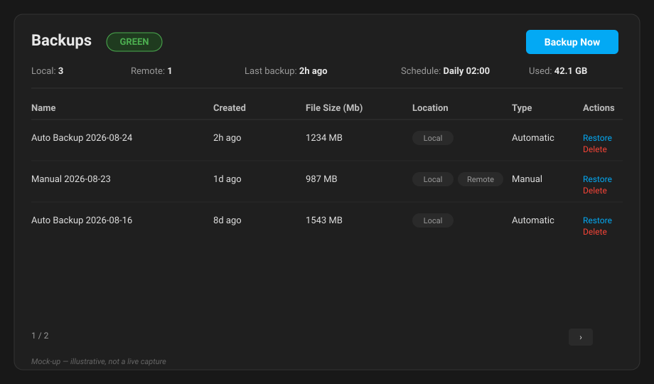
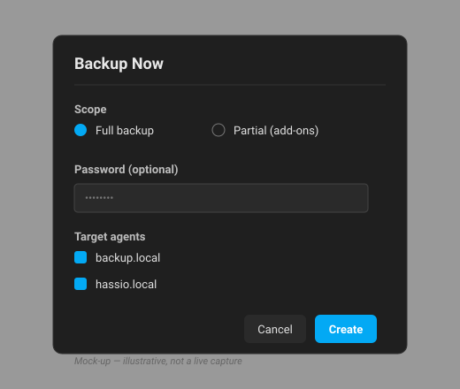

# HA Backup Card

A custom [Home Assistant](https://www.home-assistant.io/) Lovelace card for
monitoring backup health and running common backup management actions directly
from a dashboard.

> This card is structured for HACS (see `hacs.json`) but has **not** been
> submitted to the HACS store yet — install it manually using the steps below.

## What it looks like


_Overview: RAG badge, summary metrics, and the sortable backup inventory._


_The "Backup Now" dialog: scope, optional password, and target agent selection._

## Features

- RAG health badge (Green / Amber / Red) based on backup freshness and last job success.
- Summary metrics: local/remote backup counts, storage use, last job, schedule.
- Sortable, paginated backup inventory with Local / Remote / Both badges.
- Actions: Backup Now, Delete, Restore, Open Backup Manager (admin-gated).
- Configurable thresholds; read-only variant for non-admin users.
- No telemetry, no secret logging.

## Requirements

- Home Assistant **2024.7+** (backup agents / locations model).
- An admin account for management actions; non-admins get a read-only view.

## Install (manual)

### Option A — jsDelivr (simplest, no file copying)

The built card is served from jsDelivr straight from this repo's `main` branch.
Add a Lovelace resource:

```yaml
url: https://cdn.jsdelivr.net/gh/PeteOlds/HA-BackupDashboard@main/dist/backup-card.js
type: module
```

### Option B — copy the files into `www`

1. Build (or download) the contents of `dist/`.
2. Copy the **entire** `dist/` folder to
   `config/www/community/ha-backup-card/`.
   (Both `backup-card.js` and the `editor-*.js` chunk are required for the
   visual editor to work.)
3. Add a Lovelace resource pointing at the copied entry:

```yaml
url: /local/community/ha-backup-card/backup-card.js
type: module
```

### Add the card to a dashboard

In the visual editor, search for **Backup Card**, or add it via YAML:

```yaml
type: custom:backup-card
name: My Backups
threshold_green_hours: 48
threshold_amber_days: 7
threshold_free_gb: 1
```

## Configuration

| Option                 | Default | Meaning                                      |
| ---------------------- | ------- | -------------------------------------------- |
| `name`                 | —       | Card heading.                                |
| `threshold_green_hours`| 48      | Backups newer than this are Green.          |
| `threshold_amber_days` | 7       | Older than this (or >48h) are Red.           |
| `threshold_free_gb`    | 1       | Free-storage check (currently inactive — see below). |
| `refresh_interval`     | 60      | Polling interval in seconds.                 |
| `backup_path`          | `/config/backup/overview` | Destination HA route for **Open Backup Manager** and the **Change** links. Override only if your HA instance serves backups at a different path. |

> **Note:** the free-storage check is dormant. Home Assistant's `backup/info`
> does not currently expose free space, so `threshold_free_gb` has no effect
> yet.

## Building from source (optional)

```bash
npm install
npm run build      # outputs to dist/
npm run dev        # watch-build (not a dev server)
npm run test       # runs the unit tests
```

See `PRD HA Backup Card.md` and `DESIGN.md` for the full specification.
